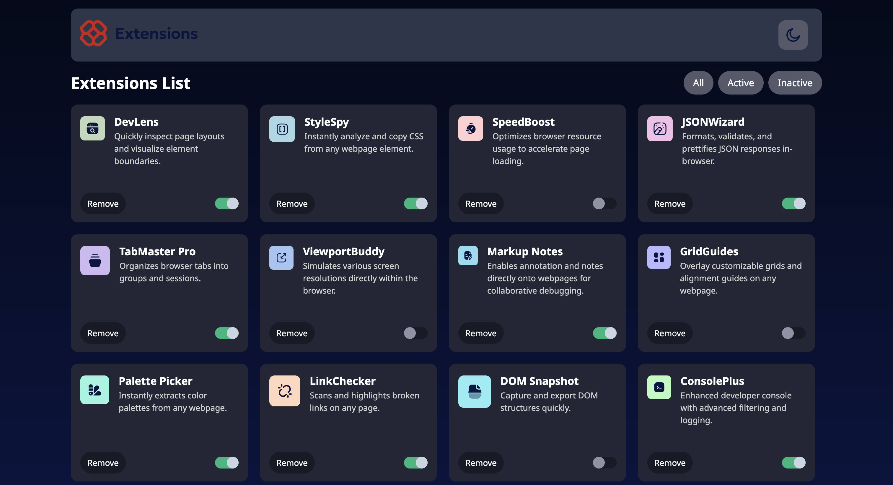

# Browser Extension UI



---

## 🧠 Tech Stack

- **React** (w/ Vite)
- **TypeScript**
- **Redux Toolkit**
- **Tailwind CSS** for styling

---

## 📦 How to Run the Project

```bash
npm install
npm run dev
```
